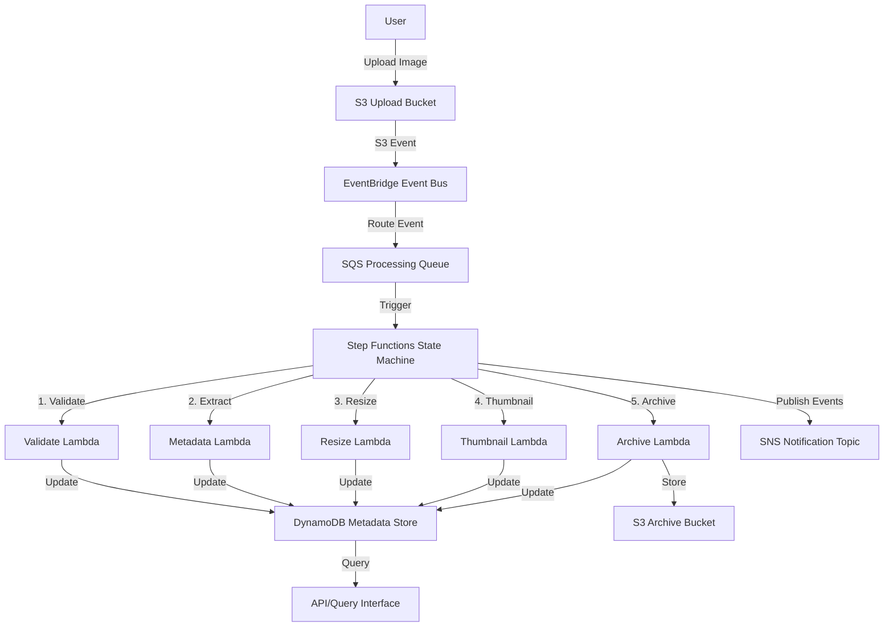

# Design Document

## Overview

The Quantum Image Processor is a serverless, event-driven, distributed image processing platform built on AWS. The system transforms a simple image upload into a multi-stage processing pipeline orchestrated by AWS Step Functions, with each processing step handled by dedicated Lambda functions. The architecture demonstrates enterprise-grade patterns including event sourcing, queue-based load leveling, and comprehensive state management.

## Architecture

### High-Level Architecture



### Event Flow

1. **Upload Phase**: User uploads image to S3 Upload Bucket
2. **Event Emission**: S3 emits event notification to EventBridge
3. **Event Routing**: EventBridge routes event to SQS queue and creates DynamoDB record
4. **Pipeline Initiation**: SQS message triggers Step Functions state machine
5. **Processing Stages**: Step Functions orchestrates 5 Lambda functions sequentially
6. **State Tracking**: Each Lambda updates DynamoDB with processing status
7. **Notification**: SNS publishes notifications at key milestones
8. **Completion**: Final processed image stored in Archive Bucket

### Technology Stack

- **Storage**: Amazon S3 (upload and archive buckets)
- **Compute**: AWS Lambda (Node.js 20.x)
- **Orchestration**: AWS Step Functions (Express Workflows)
- **Event Routing**: Amazon EventBridge
- **Queueing**: Amazon SQS (Standard Queue with DLQ)
- **Database**: Amazon DynamoDB (single-table design)
- **Notifications**: Amazon SNS
- **Infrastructure**: AWS CDK (TypeScript)
- **Image Processing**: Sharp library (Lambda Layer)

## Components and Interfaces

### 1. S3 Upload Bucket

**Purpose**: Receives uploaded images from users

**Configuration**:
- Event notifications enabled for `s3:ObjectCreated:*`
- Versioning enabled
- Lifecycle policy: transition to Glacier after 90 days
- CORS configuration for web uploads
- Encryption: AES-256

**Event Structure**:
```json
{
  "eventName": "ObjectCreated:Put",
  "s3": {
    "bucket": { "name": "upload-bucket" },
    "object": { "key": "image.jpg", "size": 1024000 }
  }
}
```

### 2. EventBridge Event Bus

**Purpose**: Routes S3 events to downstream consumers

**Rules**:
- **Rule 1**: Route to SQS queue (filter: image/* content types)
- **Rule 2**: Route to DynamoDB via Lambda (create initial metadata record)
- **Rule 3**: Route to CloudWatch Logs (audit trail)

**Event Pattern**:
```json
{
  "source": ["aws.s3"],
  "detail-type": ["Object Created"],
  "detail": {
    "bucket": { "name": ["upload-bucket"] }
  }
}
```

### 3. SQS Processing Queue

**Purpose**: Buffers processing requests and triggers Step Functions

**Configuration**:
- Visibility timeout: 300 seconds (5 minutes)
- Message retention: 4 days
- Dead Letter Queue: after 3 receive attempts
- Lambda trigger: batch size 1, concurrent executions 10

**Message Format**:
```json
{
  "imageKey": "uploads/image-123.jpg",
  "bucket": "upload-bucket",
  "uploadTimestamp": "2025-11-30T12:00:00Z",
  "contentType": "image/jpeg",
  "size": 1024000
}
```

### 4. DynamoDB Metadata Store

**Purpose**: Tracks processing state and image metadata

**Table Design**:
- **Table Name**: `ImageMetadata`
- **Partition Key**: `imageKey` (String)
- **Sort Key**: None (single-item per image)
- **GSI 1**: `status-uploadTimestamp-index` (for querying by status)

**Item Structure**:
```json
{
  "imageKey": "uploads/image-123.jpg",
  "uploadTimestamp": "2025-11-30T12:00:00Z",
  "status": "PROCESSING",
  "contentType": "image/jpeg",
  "size": 1024000,
  "stages": {
    "validation": { "status": "COMPLETED", "timestamp": "2025-11-30T12:00:01Z" },
    "metadata": { "status": "COMPLETED", "timestamp": "2025-11-30T12:00:02Z", "width": 1920, "height": 1080 },
    "resize": { "status": "COMPLETED", "timestamp": "2025-11-30T12:00:05Z" },
    "thumbnail": { "status": "COMPLETED", "timestamp": "2025-11-30T12:00:06Z" },
    "archive": { "status": "IN_PROGRESS", "timestamp": "2025-11-30T12:00:07Z" }
  },
  "archivedLocation": null,
  "errorMessage": null
}
```

**Status Values**: `UPLOADED`, `PROCESSING`, `COMPLETED`, `FAILED`, `REJECTED`

### 5. Step Functions State Machine

**Purpose**: Orchestrates the image processing pipeline

**State Machine Type**: Express Workflow (for faster execution and lower cost)

**States**:
1. **ValidateImage**: Invoke Validate Lambda
2. **ExtractMetadata**: Invoke Metadata Lambda
3. **ResizeImage**: Invoke Resize Lambda (parallel with Thumbnail)
4. **GenerateThumbnail**: Invoke Thumbnail Lambda (parallel with Resize)
5. **ArchiveImage**: Invoke Archive Lambda
6. **PublishSuccess**: Publish to SNS
7. **HandleError**: Error handling state (publishes failure to SNS)

**State Machine Definition** (simplified):
```json
{
  "StartAt": "ValidateImage",
  "States": {
    "ValidateImage": {
      "Type": "Task",
      "Resource": "arn:aws:lambda:...:function:ValidateImage",
      "Next": "ExtractMetadata",
      "Catch": [{ "ErrorEquals": ["States.ALL"], "Next": "HandleError" }],
      "Retry": [{ "ErrorEquals": ["States.TaskFailed"], "MaxAttempts": 3, "BackoffRate": 2 }]
    },
    "ExtractMetadata": {
      "Type": "Task",
      "Resource": "arn:aws:lambda:...:function:ExtractMetadata",
      "Next": "ParallelProcessing"
    },
    "ParallelProcessing": {
      "Type": "Parallel",
      "Branches": [
        { "StartAt": "ResizeImage", "States": { "ResizeImage": { "Type": "Task", "Resource": "...", "End": true } } },
        { "StartAt": "GenerateThumbnail", "States": { "GenerateThumbnail": { "Type": "Task", "Resource": "...", "End": true } } }
      ],
      "Next": "ArchiveImage"
    },
    "ArchiveImage": {
      "Type": "Task",
      "Resource": "arn:aws:lambda:...:function:ArchiveImage",
      "Next": "PublishSuccess"
    },
    "PublishSuccess": {
      "Type": "Task",
      "Resource": "arn:aws:states:::sns:publish",
      "Parameters": { "TopicArn": "...", "Message.$": "$" },
      "End": true
    },
    "HandleError": {
      "Type": "Task",
      "Resource": "arn:aws:states:::sns:publish",
      "Parameters": { "TopicArn": "...", "Message": "Processing failed" },
      "End": true
    }
  }
}
```

### 6. Lambda Functions

#### 6.1 Validate Lambda

**Purpose**: Validates image format and file integrity

**Input**:
```json
{
  "imageKey": "uploads/image-123.jpg",
  "bucket": "upload-bucket"
}
```

**Processing**:
1. Download image from S3 (stream first 1KB)
2. Check magic bytes for valid image format (JPEG, PNG, GIF, WebP)
3. Verify file is not corrupted
4. Update DynamoDB: `stages.validation.status = "COMPLETED"`

**Output**:
```json
{
  "imageKey": "uploads/image-123.jpg",
  "bucket": "upload-bucket",
  "valid": true,
  "format": "jpeg"
}
```

**Error Handling**: Throws `InvalidImageError` if validation fails

#### 6.2 Metadata Lambda

**Purpose**: Extracts image metadata (dimensions, format, EXIF data)

**Input**: Output from Validate Lambda

**Processing**:
1. Download image from S3
2. Use Sharp library to extract metadata
3. Parse EXIF data if present
4. Update DynamoDB: `stages.metadata` with width, height, format

**Output**:
```json
{
  "imageKey": "uploads/image-123.jpg",
  "bucket": "upload-bucket",
  "metadata": {
    "width": 1920,
    "height": 1080,
    "format": "jpeg",
    "space": "srgb",
    "channels": 3,
    "hasAlpha": false
  }
}
```

#### 6.3 Resize Lambda

**Purpose**: Resizes image to standard dimensions (1024x768)

**Input**: Output from Metadata Lambda

**Processing**:
1. Download image from S3
2. Use Sharp to resize (maintain aspect ratio, fit within bounds)
3. Upload resized image to S3: `processed/{imageKey}/resized.jpg`
4. Update DynamoDB: `stages.resize.status = "COMPLETED"`

**Output**:
```json
{
  "imageKey": "uploads/image-123.jpg",
  "resizedKey": "processed/image-123/resized.jpg"
}
```

#### 6.4 Thumbnail Lambda

**Purpose**: Generates thumbnail (200x200)

**Input**: Output from Metadata Lambda

**Processing**:
1. Download image from S3
2. Use Sharp to create thumbnail (crop to square, resize to 200x200)
3. Upload thumbnail to S3: `processed/{imageKey}/thumbnail.jpg`
4. Update DynamoDB: `stages.thumbnail.status = "COMPLETED"`

**Output**:
```json
{
  "imageKey": "uploads/image-123.jpg",
  "thumbnailKey": "processed/image-123/thumbnail.jpg"
}
```

#### 6.5 Archive Lambda

**Purpose**: Moves processed images to archive bucket

**Input**: Combined output from Resize and Thumbnail Lambdas

**Processing**:
1. Copy original image to Archive Bucket
2. Copy resized image to Archive Bucket
3. Copy thumbnail to Archive Bucket
4. Update DynamoDB: `archivedLocation`, `status = "COMPLETED"`
5. Optionally delete from Upload Bucket

**Output**:
```json
{
  "imageKey": "uploads/image-123.jpg",
  "archivedLocation": "archive/2025/11/30/image-123/",
  "status": "COMPLETED"
}
```

### 7. SNS Notification Topic

**Purpose**: Publishes processing status notifications

**Subscribers**: Email, SQS (for downstream systems), CloudWatch Logs

**Message Types**:
- `PROCESSING_STARTED`: When Step Functions begins
- `PROCESSING_COMPLETED`: When all stages complete
- `PROCESSING_FAILED`: When any stage fails after retries

**Message Format**:
```json
{
  "eventType": "PROCESSING_COMPLETED",
  "imageKey": "uploads/image-123.jpg",
  "timestamp": "2025-11-30T12:00:10Z",
  "processingDuration": 10000,
  "stages": ["validation", "metadata", "resize", "thumbnail", "archive"]
}
```

## Data Models

### ImageMetadata (DynamoDB)

```typescript
interface ImageMetadata {
  imageKey: string;                    // PK
  uploadTimestamp: string;             // ISO 8601
  status: 'UPLOADED' | 'PROCESSING' | 'COMPLETED' | 'FAILED' | 'REJECTED';
  contentType: string;
  size: number;                        // bytes
  stages: {
    validation?: StageInfo;
    metadata?: StageInfo & { width: number; height: number; format: string };
    resize?: StageInfo;
    thumbnail?: StageInfo;
    archive?: StageInfo;
  };
  archivedLocation?: string;
  errorMessage?: string;
  ttl?: number;                        // Unix timestamp for auto-deletion
}

interface StageInfo {
  status: 'IN_PROGRESS' | 'COMPLETED' | 'FAILED';
  timestamp: string;
  errorMessage?: string;
}
```

### ProcessingEvent (EventBridge)

```typescript
interface ProcessingEvent {
  source: 'image-processor';
  detailType: 'ImageUploaded' | 'ProcessingStarted' | 'ProcessingCompleted' | 'ProcessingFailed';
  detail: {
    imageKey: string;
    bucket: string;
    timestamp: string;
    status: string;
    metadata?: Record<string, any>;
  };
}
```

### StepFunctionsInput

```typescript
interface StepFunctionsInput {
  imageKey: string;
  bucket: string;
  uploadTimestamp: string;
  contentType: string;
  size: number;
}
```

## Correctness Properties

*A property is a characteristic or behavior that should hold true across all valid executions of a system-essentially, a formal statement about what the system should do. Properties serve as the bridge between human-readable specifications and machine-verifiable correctness guarantees.*

### Property 1: Metadata record creation with required fields

*For any* valid image upload, the system should create a DynamoDB record containing imageKey, uploadTimestamp, size, contentType, and initial status "UPLOADED"

**Validates: Requirements 1.3, 5.1**

### Property 2: Message enqueueing on upload

*For any* image uploaded to the Upload Bucket, a corresponding processing message should appear in the SQS Processing Queue

**Validates: Requirements 1.4**

### Property 3: Invalid file rejection

*For any* non-image file uploaded to the Upload Bucket, the system should update the Metadata Store with status "REJECTED" and not enqueue a processing message

**Validates: Requirements 1.5**

### Property 4: Status progression through pipeline

*For any* image processing execution, the status should progress from "UPLOADED" → "PROCESSING" → "COMPLETED" (or "FAILED"), never skipping states or moving backwards

**Validates: Requirements 2.2, 2.3**

### Property 5: Retry logic with exponential backoff

*For any* Lambda function that fails with a retryable error, the system should retry up to 3 times with exponentially increasing delays (2s, 4s, 8s)

**Validates: Requirements 2.4, 6.1**

### Property 6: Lambda error logging

*For any* Lambda function failure, the system should log the error with imageKey, function name, error message, and timestamp

**Validates: Requirements 3.6**

### Property 7: Event publishing with required context

*For any* processing event (stage completion, pipeline start/end), the system should publish an event containing timestamp, imageKey, and stage information

**Validates: Requirements 4.1, 4.2, 4.4**

### Property 8: Stage timestamp tracking

*For any* processing stage that completes, the system should update the DynamoDB record with the stage name and completion timestamp

**Validates: Requirements 5.2**

### Property 9: Query support by multiple fields

*For any* query to the Metadata Store by imageKey, upload date range, or status, the system should return all matching records

**Validates: Requirements 5.3**

### Property 10: Dead letter queue handling

*For any* message that fails processing after 3 retry attempts, the system should move the message to the Dead Letter Queue

**Validates: Requirements 6.2**

### Property 11: Error capture and notification

*For any* permanent processing failure, the system should store error details in DynamoDB and publish a failure notification to SNS

**Validates: Requirements 6.3, 6.5**

### Property 12: Archived location storage

*For any* successfully completed pipeline execution, the DynamoDB record should contain the archivedLocation field with the S3 path

**Validates: Requirements 5.4**

## Error Handling

### Error Categories

1. **Validation Errors** (4xx-equivalent)
   - Invalid image format
   - Corrupted file
   - File too large (>10MB)
   - **Handling**: Reject immediately, set status to "REJECTED", do not retry

2. **Transient Errors** (5xx-equivalent)
   - S3 throttling
   - DynamoDB throttling
   - Lambda timeout
   - **Handling**: Retry with exponential backoff (3 attempts)

3. **Permanent Errors**
   - Lambda function error (code bug)
   - Out of memory
   - Missing permissions
   - **Handling**: Move to DLQ after retries, publish failure notification

### Retry Strategy

**Step Functions Retry Configuration**:
```json
{
  "Retry": [
    {
      "ErrorEquals": ["Lambda.ServiceException", "Lambda.TooManyRequestsException"],
      "IntervalSeconds": 2,
      "MaxAttempts": 3,
      "BackoffRate": 2.0
    },
    {
      "ErrorEquals": ["States.TaskFailed"],
      "IntervalSeconds": 1,
      "MaxAttempts": 2,
      "BackoffRate": 1.5
    }
  ],
  "Catch": [
    {
      "ErrorEquals": ["States.ALL"],
      "Next": "HandleError",
      "ResultPath": "$.error"
    }
  ]
}
```

**SQS Retry Configuration**:
- Max receive count: 3
- Visibility timeout: 300 seconds
- Dead Letter Queue: enabled

### Error Logging

All errors logged to CloudWatch Logs with structured format:
```json
{
  "level": "ERROR",
  "timestamp": "2025-11-30T12:00:00Z",
  "imageKey": "uploads/image-123.jpg",
  "function": "ResizeLambda",
  "error": {
    "type": "ProcessingError",
    "message": "Failed to resize image",
    "stack": "..."
  },
  "context": {
    "attemptNumber": 2,
    "executionArn": "arn:aws:states:..."
  }
}
```

## Testing Strategy

### Unit Testing

**Framework**: Jest (Node.js)

**Unit Test Coverage**:
1. **Lambda Function Logic**:
   - Validate Lambda: Test magic byte detection for JPEG, PNG, GIF, WebP
   - Metadata Lambda: Test Sharp metadata extraction
   - Resize Lambda: Test image resizing with various aspect ratios
   - Thumbnail Lambda: Test thumbnail generation and cropping
   - Archive Lambda: Test S3 copy operations

2. **Error Handling**:
   - Test validation errors (invalid format, corrupted file)
   - Test error logging format
   - Test DynamoDB update on errors

3. **Integration Points**:
   - Test DynamoDB update operations
   - Test S3 get/put operations (with mocked AWS SDK)
   - Test SNS publish operations

**Example Unit Test**:
```typescript
describe('ValidateLambda', () => {
  it('should detect JPEG format from magic bytes', async () => {
    const mockS3 = { getObject: jest.fn().mockResolvedValue({ Body: jpegBuffer }) };
    const result = await validateImage({ imageKey: 'test.jpg', bucket: 'test' }, mockS3);
    expect(result.valid).toBe(true);
    expect(result.format).toBe('jpeg');
  });

  it('should reject non-image files', async () => {
    const mockS3 = { getObject: jest.fn().mockResolvedValue({ Body: textBuffer }) };
    await expect(validateImage({ imageKey: 'test.txt', bucket: 'test' }, mockS3))
      .rejects.toThrow('InvalidImageError');
  });
});
```

### Property-Based Testing

**Framework**: fast-check (JavaScript property-based testing library)

**Configuration**: Each property test should run a minimum of 100 iterations

**Property Test Requirements**:
- Each property-based test MUST include a comment referencing the design document property
- Comment format: `// Feature: quantum-image-processor, Property {number}: {property_text}`
- Each correctness property MUST be implemented by a SINGLE property-based test

**Property Test Coverage**:

1. **Property 1: Metadata record creation**
   - Generate random valid images (various formats, sizes)
   - Upload each image
   - Verify DynamoDB record contains all required fields

2. **Property 3: Invalid file rejection**
   - Generate random non-image files (text, JSON, binary)
   - Attempt upload
   - Verify status is "REJECTED" and no SQS message

3. **Property 4: Status progression**
   - Generate random valid images
   - Process through pipeline
   - Verify status never moves backwards or skips states

4. **Property 5: Retry logic**
   - Generate random transient errors
   - Verify retry count and backoff timing

5. **Property 7: Event publishing**
   - Generate random processing events
   - Verify all events contain required fields (timestamp, imageKey, stage)

6. **Property 8: Stage timestamp tracking**
   - Generate random pipeline executions
   - Verify each stage has a timestamp and timestamps are monotonically increasing

7. **Property 9: Query support**
   - Generate random image metadata records
   - Query by various fields
   - Verify all matching records are returned

**Example Property Test**:
```typescript
import fc from 'fast-check';

// Feature: quantum-image-processor, Property 1: Metadata record creation with required fields
describe('Property: Metadata record creation', () => {
  it('should create complete metadata record for any valid image', async () => {
    await fc.assert(
      fc.asyncProperty(
        fc.record({
          imageKey: fc.string({ minLength: 1 }),
          contentType: fc.constantFrom('image/jpeg', 'image/png', 'image/gif'),
          size: fc.integer({ min: 1, max: 10000000 })
        }),
        async (imageData) => {
          // Upload image
          await uploadImage(imageData);

          // Query DynamoDB
          const record = await getMetadata(imageData.imageKey);

          // Verify all required fields exist
          expect(record).toHaveProperty('imageKey', imageData.imageKey);
          expect(record).toHaveProperty('uploadTimestamp');
          expect(record).toHaveProperty('size', imageData.size);
          expect(record).toHaveProperty('contentType', imageData.contentType);
          expect(record).toHaveProperty('status', 'UPLOADED');
        }
      ),
      { numRuns: 100 }
    );
  });
});
```

### Integration Testing

**Scope**: End-to-end pipeline testing with real AWS services (in test environment)

**Test Scenarios**:
1. Upload valid image → verify complete pipeline execution → check archived files
2. Upload invalid file → verify rejection → check no processing occurred
3. Simulate Lambda failure → verify retry logic → check DLQ
4. Upload multiple images concurrently → verify all process correctly

**Tools**: AWS SDK, Jest, LocalStack (for local testing)

### Performance Testing

**Metrics to Track**:
- End-to-end processing time (target: <30 seconds)
- Lambda cold start time (target: <3 seconds)
- DynamoDB read/write latency (target: <100ms)
- S3 upload/download time (varies by file size)

**Load Testing**:
- Simulate 100 concurrent uploads
- Verify SQS queue handles backlog
- Verify Lambda concurrency limits
- Monitor CloudWatch metrics

## Deployment Strategy

### Infrastructure as Code

**Tool**: AWS CDK (TypeScript)

**Stack Structure**:
```
lib/
  quantum-image-processor-stack.ts    # Main stack
  constructs/
    storage-construct.ts              # S3 buckets
    compute-construct.ts              # Lambda functions
    orchestration-construct.ts        # Step Functions
    data-construct.ts                 # DynamoDB
    messaging-construct.ts            # SQS, SNS, EventBridge
```

### CDK Stack Example

```typescript
export class QuantumImageProcessorStack extends Stack {
  constructor(scope: Construct, id: string, props?: StackProps) {
    super(scope, id, props);

    // S3 Buckets
    const uploadBucket = new s3.Bucket(this, 'UploadBucket', {
      encryption: s3.BucketEncryption.S3_MANAGED,
      versioned: true,
      lifecycleRules: [
        { transitions: [{ storageClass: s3.StorageClass.GLACIER, transitionAfter: Duration.days(90) }] }
      ],
      eventBridgeEnabled: true
    });

    const archiveBucket = new s3.Bucket(this, 'ArchiveBucket', {
      encryption: s3.BucketEncryption.S3_MANAGED
    });

    // DynamoDB Table
    const metadataTable = new dynamodb.Table(this, 'MetadataTable', {
      partitionKey: { name: 'imageKey', type: dynamodb.AttributeType.STRING },
      billingMode: dynamodb.BillingMode.PAY_PER_REQUEST,
      pointInTimeRecovery: true
    });

    metadataTable.addGlobalSecondaryIndex({
      indexName: 'status-uploadTimestamp-index',
      partitionKey: { name: 'status', type: dynamodb.AttributeType.STRING },
      sortKey: { name: 'uploadTimestamp', type: dynamodb.AttributeType.STRING }
    });

    // Lambda Layer (Sharp)
    const sharpLayer = new lambda.LayerVersion(this, 'SharpLayer', {
      code: lambda.Code.fromAsset('layers/sharp'),
      compatibleRuntimes: [lambda.Runtime.NODEJS_20_X]
    });

    // Lambda Functions
    const validateLambda = new lambda.Function(this, 'ValidateLambda', {
      runtime: lambda.Runtime.NODEJS_20_X,
      handler: 'index.handler',
      code: lambda.Code.fromAsset('lambda/validate'),
      layers: [sharpLayer],
      environment: {
        METADATA_TABLE: metadataTable.tableName
      },
      timeout: Duration.seconds(30)
    });

    // Grant permissions
    uploadBucket.grantRead(validateLambda);
    metadataTable.grantReadWriteData(validateLambda);

    // ... (similar for other Lambdas)

    // SQS Queue
    const dlq = new sqs.Queue(this, 'DLQ', {
      retentionPeriod: Duration.days(14)
    });

    const processingQueue = new sqs.Queue(this, 'ProcessingQueue', {
      visibilityTimeout: Duration.seconds(300),
      deadLetterQueue: {
        queue: dlq,
        maxReceiveCount: 3
      }
    });

    // Step Functions State Machine
    const stateMachine = new sfn.StateMachine(this, 'ProcessingPipeline', {
      definition: /* state machine definition */,
      stateMachineType: sfn.StateMachineType.EXPRESS
    });

    // EventBridge Rule
    const rule = new events.Rule(this, 'S3UploadRule', {
      eventPattern: {
        source: ['aws.s3'],
        detailType: ['Object Created'],
        detail: {
          bucket: { name: [uploadBucket.bucketName] }
        }
      }
    });

    rule.addTarget(new targets.SqsQueue(processingQueue));

    // SNS Topic
    const notificationTopic = new sns.Topic(this, 'NotificationTopic');
  }
}
```

### Deployment Environments

1. **Development**: LocalStack + local DynamoDB
2. **Staging**: AWS account with reduced resources
3. **Production**: AWS account with full resources and monitoring

### CI/CD Pipeline

1. **Build**: Compile TypeScript, bundle Lambda functions
2. **Test**: Run unit tests and property tests
3. **Synth**: Generate CloudFormation templates
4. **Deploy**: Deploy to staging, run integration tests
5. **Promote**: Deploy to production after approval

## Monitoring and Observability

### CloudWatch Metrics

**Custom Metrics**:
- `ImageProcessingDuration`: Time from upload to completion
- `ValidationFailures`: Count of rejected images
- `PipelineFailures`: Count of failed pipelines
- `StageExecutionTime`: Time per processing stage

### CloudWatch Alarms

1. **High Error Rate**: >5% of pipelines failing
2. **Long Processing Time**: >60 seconds average
3. **DLQ Depth**: >10 messages in DLQ
4. **Lambda Throttling**: Any throttled invocations

### X-Ray Tracing

Enable X-Ray for all Lambda functions and Step Functions to trace request flow through the system.

### Logging Strategy

- **Lambda Logs**: Structured JSON logs to CloudWatch
- **Step Functions Logs**: Execution history with input/output
- **EventBridge Logs**: Event delivery tracking
- **S3 Access Logs**: Upload and download tracking

## Security Considerations

### IAM Roles

Each component has a dedicated IAM role with least-privilege permissions:

**Validate Lambda Role**:
```json
{
  "Version": "2012-10-17",
  "Statement": [
    {
      "Effect": "Allow",
      "Action": ["s3:GetObject"],
      "Resource": "arn:aws:s3:::upload-bucket/*"
    },
    {
      "Effect": "Allow",
      "Action": ["dynamodb:PutItem", "dynamodb:UpdateItem"],
      "Resource": "arn:aws:dynamodb:*:*:table/ImageMetadata"
    }
  ]
}
```

### Encryption

- **S3**: Server-side encryption (SSE-S3) for all buckets
- **DynamoDB**: Encryption at rest enabled
- **SQS**: Server-side encryption enabled
- **SNS**: Encryption in transit (HTTPS)

### Network Security

- Lambda functions run in VPC (optional, for private resources)
- S3 bucket policies restrict access to specific IAM roles
- EventBridge rules scoped to specific event patterns

## Cost Optimization

### Estimated Monthly Costs (1000 images/day)

- **S3 Storage**: $0.50 (assuming 1GB average)
- **Lambda Invocations**: $2.00 (150,000 invocations)
- **Step Functions**: $0.75 (30,000 state transitions)
- **DynamoDB**: $1.00 (read/write units)
- **SQS**: $0.10 (requests)
- **SNS**: $0.05 (notifications)
- **Data Transfer**: $1.00

**Total**: ~$5.40/month

### Cost Optimization Strategies

1. Use S3 Lifecycle policies to move old images to Glacier
2. Use DynamoDB on-demand pricing for variable workloads
3. Use Step Functions Express Workflows (cheaper than Standard)
4. Implement S3 Intelligent-Tiering for automatic cost optimization
5. Set Lambda memory to optimal size (not over-provisioned)

## Future Enhancements

1. **Multi-region replication**: Replicate images across regions for disaster recovery
2. **CDN integration**: Serve processed images via CloudFront
3. **Advanced image processing**: Face detection, object recognition, OCR
4. **Batch processing**: Process multiple images in a single Lambda invocation
5. **Real-time progress updates**: WebSocket API for live progress tracking
6. **Image optimization**: Automatic format conversion (WebP, AVIF)
7. **Watermarking**: Add watermarks to processed images
8. **Video support**: Extend pipeline to handle video uploads
