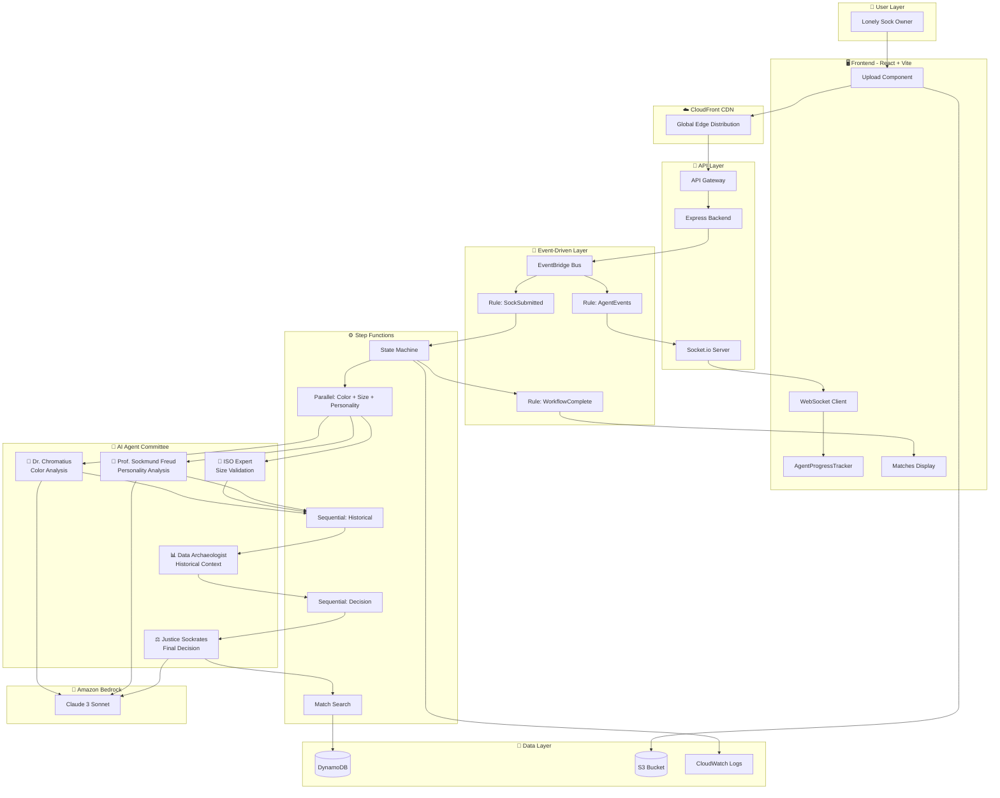
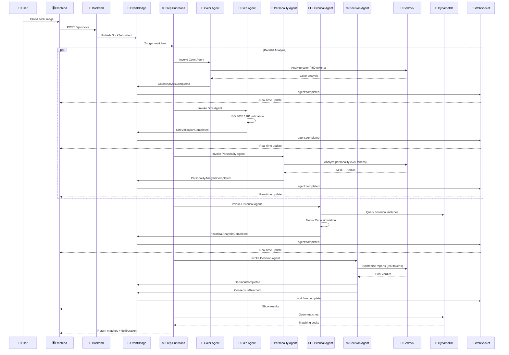
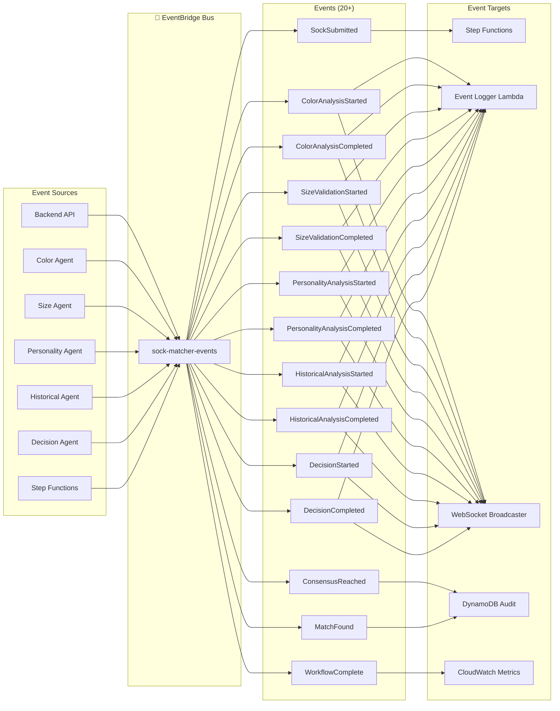
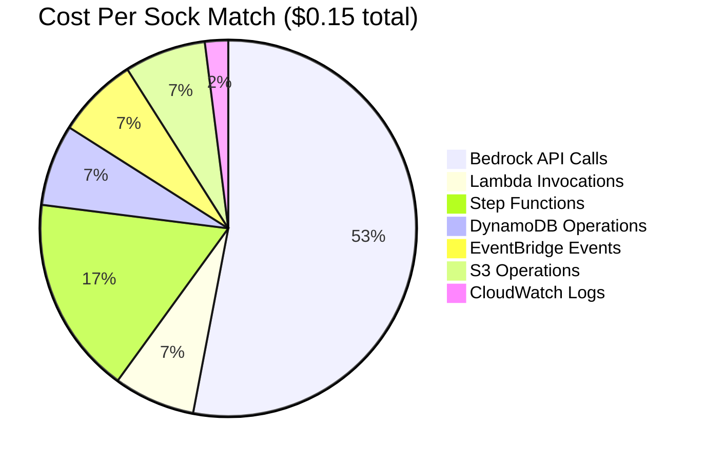
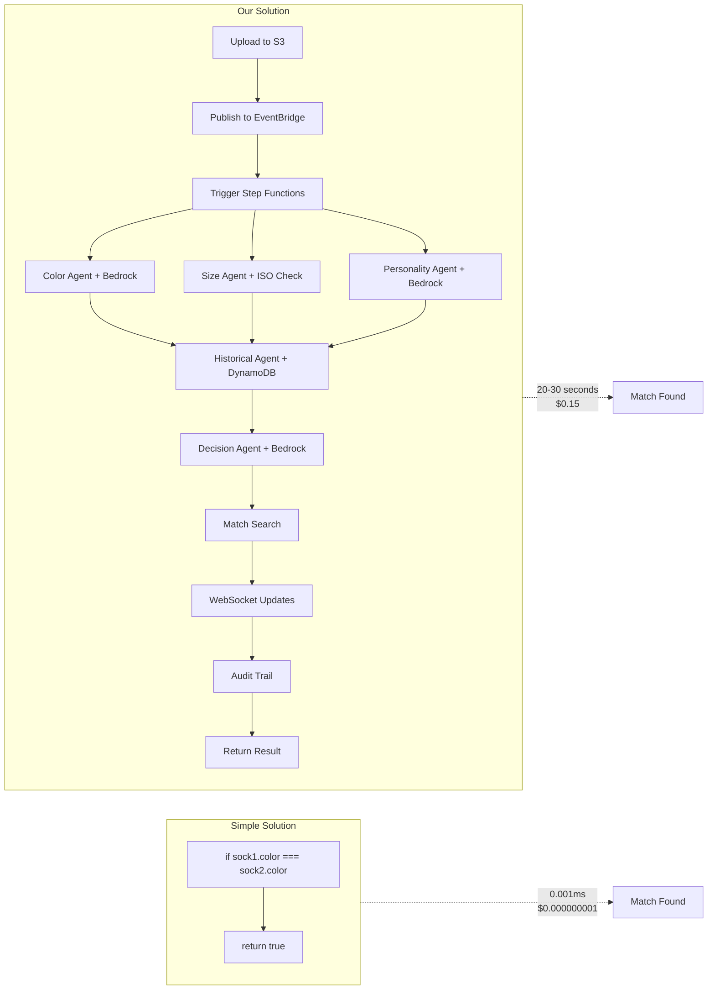

# Sock Matcher Architecture - Mermaid Diagrams

## High-Level Architecture

```mermaid
flowchart TB
    subgraph User["👤 User Layer"]
        U[Lonely Sock Owner]
    end

    subgraph Frontend["🖥️ Frontend - React + Vite"]
        UI[Upload Component]
        APT[AgentProgressTracker]
        WS[WebSocket Client]
        M[Matches Display]
    end

    subgraph CDN["☁️ CloudFront CDN"]
        CF[Global Edge Distribution]
    end

    subgraph API["🔌 API Layer"]
        AG[API Gateway]
        BE[Express Backend]
        WSS[Socket.io Server]
    end

    subgraph Events["📡 Event-Driven Layer"]
        EB[EventBridge Bus]
        R1[Rule: SockSubmitted]
        R2[Rule: AgentEvents]
        R3[Rule: WorkflowComplete]
    end

    subgraph Workflow["⚙️ Step Functions"]
        SF[State Machine]
        P1[Parallel: Color + Size + Personality]
        S1[Sequential: Historical]
        S2[Sequential: Decision]
        MS[Match Search]
    end

    subgraph Agents["🤖 AI Agent Committee"]
        CA[🎨 Dr. Chromatius<br/>Color Analysis]
        SA[📏 ISO Expert<br/>Size Validation]
        PA[🔮 Prof. Sockmund Freud<br/>Personality Analysis]
        HA[📊 Data Archaeologist<br/>Historical Context]
        DA[⚖️ Justice Sockrates<br/>Final Decision]
    end

    subgraph AI["🧠 Amazon Bedrock"]
        CL[Claude 3 Sonnet]
    end

    subgraph Data["💾 Data Layer"]
        DDB[(DynamoDB)]
        S3[(S3 Bucket)]
        CW[CloudWatch Logs]
    end

    U --> UI
    UI --> CF
    CF --> AG
    AG --> BE
    BE --> EB
    EB --> R1
    R1 --> SF
    SF --> P1
    P1 --> CA & SA & PA
    CA & SA & PA --> S1
    S1 --> HA
    HA --> S2
    S2 --> DA
    DA --> MS
    MS --> DDB
    CA & PA & DA --> CL
    EB --> R2
    R2 --> WSS
    WSS --> WS
    WS --> APT
    SF --> R3
    R3 --> M
    UI --> S3
    SF --> CW
```

## Agent Workflow Detail

```mermaid
sequenceDiagram
    participant U as 👤 User
    participant FE as 🖥️ Frontend
    participant BE as 🔌 Backend
    participant EB as 📡 EventBridge
    participant SF as ⚙️ Step Functions
    participant CA as 🎨 Color Agent
    participant SA as 📏 Size Agent
    participant PA as 🔮 Personality Agent
    participant HA as 📊 Historical Agent
    participant DA as ⚖️ Decision Agent
    participant BR as 🧠 Bedrock
    participant DB as 💾 DynamoDB
    participant WS as 🔌 WebSocket

    U->>FE: Upload sock image
    FE->>BE: POST /api/socks
    BE->>EB: Publish SockSubmitted
    EB->>SF: Trigger workflow
    
    par Parallel Analysis
        SF->>CA: Invoke Color Agent
        CA->>BR: Analyze color (450 tokens)
        BR-->>CA: Color analysis
        CA->>EB: ColorAnalysisCompleted
        EB->>WS: agent:completed
        WS-->>FE: Real-time update
        
        SF->>SA: Invoke Size Agent
        SA->>SA: ISO 3635:1981 validation
        SA->>EB: SizeValidationCompleted
        EB->>WS: agent:completed
        WS-->>FE: Real-time update
        
        SF->>PA: Invoke Personality Agent
        PA->>BR: Analyze personality (520 tokens)
        BR-->>PA: MBTI + Zodiac
        PA->>EB: PersonalityAnalysisCompleted
        EB->>WS: agent:completed
        WS-->>FE: Real-time update
    end
    
    SF->>HA: Invoke Historical Agent
    HA->>DB: Query historical matches
    HA->>HA: Monte Carlo simulation
    HA->>EB: HistoricalAnalysisCompleted
    EB->>WS: agent:completed
    WS-->>FE: Real-time update
    
    SF->>DA: Invoke Decision Agent
    DA->>BR: Synthesize reports (890 tokens)
    BR-->>DA: Final verdict
    DA->>EB: DecisionCompleted
    DA->>EB: ConsensusReached
    EB->>WS: workflow:complete
    WS-->>FE: Show results
    
    SF->>DB: Query matches
    DB-->>SF: Matching socks
    SF-->>FE: Return matches + deliberation
```

## Event Flow

```mermaid
flowchart LR
    subgraph Sources["Event Sources"]
        BE[Backend API]
        CA[Color Agent]
        SA[Size Agent]
        PA[Personality Agent]
        HA[Historical Agent]
        DA[Decision Agent]
        SF[Step Functions]
    end

    subgraph EventBridge["📡 EventBridge Bus"]
        EB[sock-matcher-events]
    end

    subgraph Events["Events (20+)"]
        E1[SockSubmitted]
        E2[ColorAnalysisStarted]
        E3[ColorAnalysisCompleted]
        E4[SizeValidationStarted]
        E5[SizeValidationCompleted]
        E6[PersonalityAnalysisStarted]
        E7[PersonalityAnalysisCompleted]
        E8[HistoricalAnalysisStarted]
        E9[HistoricalAnalysisCompleted]
        E10[DecisionStarted]
        E11[DecisionCompleted]
        E12[ConsensusReached]
        E13[MatchFound]
        E14[WorkflowComplete]
    end

    subgraph Targets["Event Targets"]
        T1[Step Functions]
        T2[Event Logger Lambda]
        T3[WebSocket Broadcaster]
        T4[DynamoDB Audit]
        T5[CloudWatch Metrics]
    end

    BE --> EB
    CA --> EB
    SA --> EB
    PA --> EB
    HA --> EB
    DA --> EB
    SF --> EB

    EB --> E1 & E2 & E3 & E4 & E5 & E6 & E7 & E8 & E9 & E10 & E11 & E12 & E13 & E14

    E1 --> T1
    E2 & E3 & E4 & E5 & E6 & E7 & E8 & E9 & E10 & E11 --> T2 & T3
    E12 & E13 --> T4
    E14 --> T5
```

## Cost Breakdown

```mermaid
pie title Cost Per Sock Match ($0.15 total)
    "Bedrock API Calls" : 53
    "Lambda Invocations" : 7
    "Step Functions" : 17
    "DynamoDB Operations" : 7
    "EventBridge Events" : 7
    "S3 Operations" : 7
    "CloudWatch Logs" : 2
```

## Comparison: Simple vs Our Solution

```mermaid
graph LR
    subgraph Simple["Simple Solution"]
        S1[if sock1.color === sock2.color]
        S2[return true]
        S1 --> S2
    end

    subgraph Ours["Our Solution"]
        O1[Upload to S3]
        O2[Publish to EventBridge]
        O3[Trigger Step Functions]
        O4[Color Agent + Bedrock]
        O5[Size Agent + ISO Check]
        O6[Personality Agent + Bedrock]
        O7[Historical Agent + DynamoDB]
        O8[Decision Agent + Bedrock]
        O9[Match Search]
        O10[WebSocket Updates]
        O11[Audit Trail]
        O12[Return Result]
        
        O1 --> O2 --> O3 --> O4 & O5 & O6
        O4 & O5 & O6 --> O7 --> O8 --> O9 --> O10 --> O11 --> O12
    end

    Simple -.->|"0.001ms<br/>$0.000000001"| Result1[Match Found]
    Ours -.->|"20-30 seconds<br/>$0.15"| Result2[Match Found]
```
