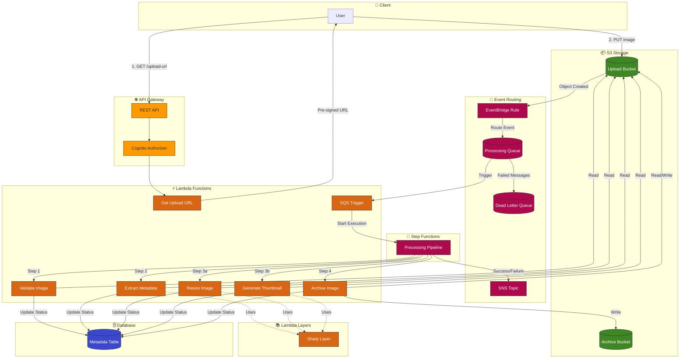
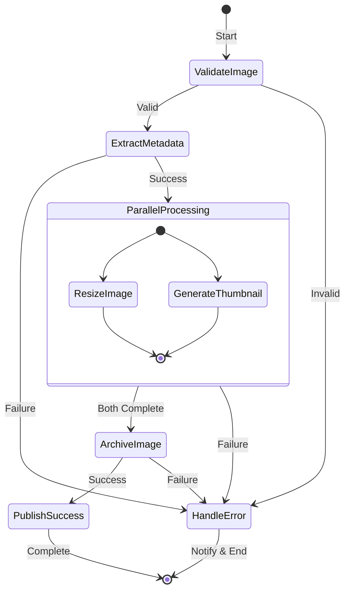

# Quantum Image Processor Architecture

> An enterprise-grade, cloud-native, serverless image processing platform that transforms the simple act of uploading an image into a sophisticated, multi-stage, event-driven workflow.

## Architecture Diagram

## Processing Pipeline Flow

## Component Summary

| Component | AWS Service | Purpose |
|-----------|-------------|---------|
| Upload Bucket | S3 | Receives uploaded images |
| Archive Bucket | S3 | Long-term storage for processed images |
| Metadata Table | DynamoDB | Tracks image processing state |
| Processing Queue | SQS | Buffers processing requests |
| Dead Letter Queue | SQS | Captures failed messages |
| Notification Topic | SNS | Broadcasts processing status |
| Processing Pipeline | Step Functions | Orchestrates Lambda functions |
| Event Rule | EventBridge | Routes S3 events to SQS |
| REST API | API Gateway | Provides upload URL endpoint |
| Authorizer | Cognito | Authenticates API requests |
| Lambda Functions | Lambda | Performs atomic processing operations |
| Sharp Layer | Lambda Layer | Image processing library |

## Data Flow

1. **Upload Request**: Client requests pre-signed URL via API Gateway
2. **Image Upload**: Client uploads image directly to S3 using pre-signed URL
3. **Event Trigger**: S3 emits ObjectCreated event to EventBridge
4. **Queue Processing**: EventBridge routes event to SQS queue
5. **Pipeline Start**: SQS triggers Lambda which starts Step Functions
6. **Validation**: Validate image format and create metadata record
7. **Metadata Extraction**: Extract EXIF data and image properties
8. **Parallel Processing**: Resize image and generate thumbnail concurrently
9. **Archive**: Copy processed image to archive bucket
10. **Notification**: Publish success/failure notification via SNS
